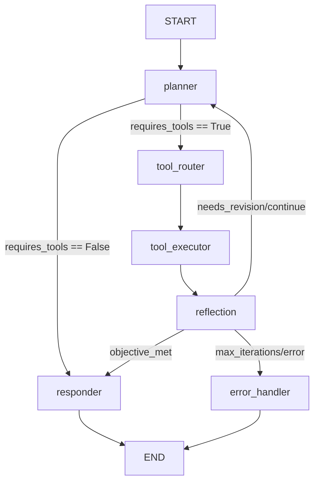
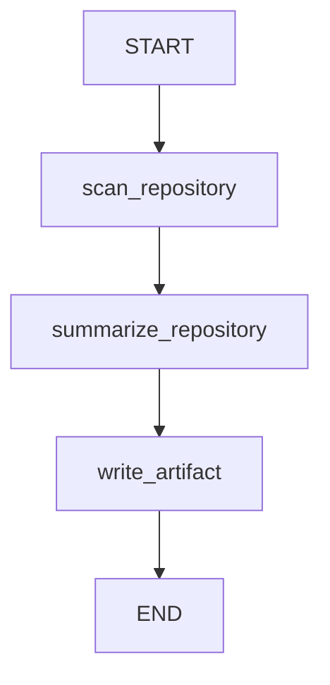
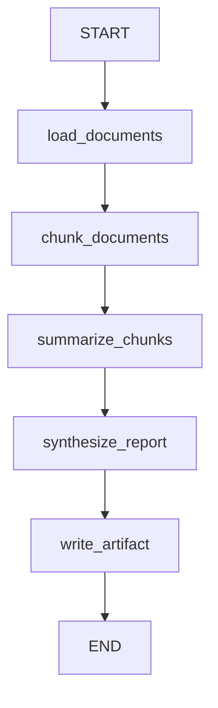
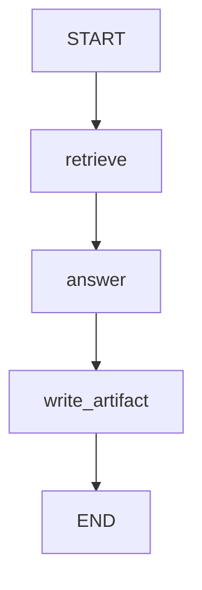
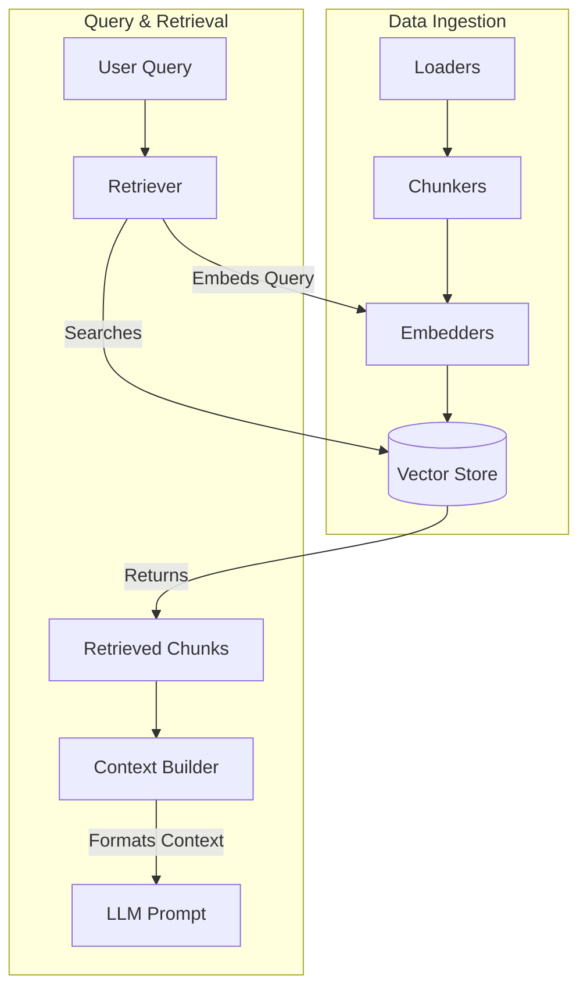

# Jarvis Assistant Runtime

A powerful, LangGraph-powered AI Assistant designed to serve as an autonomous coding and system management companion. It leverages reasoning models to plan, execute tools, reflect on outcomes, and synthesize final responses.

## Architecture

The orchestration engine uses **LangGraph** to manage a robust state machine workflow:



### Core Nodes
- **`planner`**: Evaluates the objective and builds a step-by-step JSON Execution Plan. Handles replanning if feedback is provided.
- **`tool_router`**: Advances the plan and routes to the executor.
- **`tool_executor`**: Safely executes tools, catching exceptions and returning standardized output.
- **`reflection`**: Evaluates the tool's output (or errors) against the objective to decide if the plan succeeded, needs revision, or is finished.
- **`responder`**: Synthesizes the execution context and finalizes a human-readable response.
- **`error_handler`**: Gracefully manages loop terminations or catastrophic failures.

## Capabilities & Tools

Jarvis is equipped with a centralized `ToolRegistry` that can be easily extended. Built-in filesystem and system tools include:

* **`list_dir`**: List contents of a given directory.
* **`read_file`**: Read a file's contents safely with UTF-8 encoding.
* **`write_file`**: Overwrite or create files.
* **`find_file`**: Recursively locate files using glob patterns, automatically bypassing heavy directories (e.g., `.git`, `node_modules`).
* **`grep_search`**: Recursively search inside text files for patterns or RegEx.
* **`run_command`**: Execute system shell commands (e.g., Python scripts, tests) with output truncation and timeouts to protect context limits.

## Smart JSON Parsing

Reasoning models (like DeepSeek, Llama-3, Qwen) often inject `<think>` blocks before their JSON output. The `StructuredOutputParser` actively intercepts and strips these thought sequences before safely extracting the JSON blocks.


* **Service-Oriented Orchestration**: Core business logic has been extracted into dedicated services (e.g., `RepositoryService`, `SummarizationService`), keeping workflow nodes thin and focused entirely on LangGraph orchestration.
* **Lightweight State & Caching**: Massive objects are no longer stuffed into workflow state. `RuntimeCache` saves large payloads (like codebase scans) to disk, passing lightweight string references through the graph.
* **Rich Metadata Extraction**: File summarization utilizes strict Pydantic parsing to extract deep metadata, capturing `exports`, `env_vars`, executable `commands`, `dependencies`, and `side_effects` natively.
* **LLM Resilience**: All LLM calls are hardened with strict timeouts (`asyncio.wait_for`) and 3-attempt exponential backoff retry loops to prevent deadlocks and handle transient failures.
* **Universal Execution Tracing**: `SequentialWorkflow` now compiles internally using `LangGraph`, enabling consistent execution tracing. The new `WorkflowTracer` cleanly logs execution durations and LLM performance.
* **Centralized Prompting**: The `PromptBuilder` isolates all system prompts, keeping prompt templates clean and modular.

## Workflows

The system now supports three foundational orchestrated workflows, all compiled under the LangGraph engine for full tracing and structured execution:

### Repository Analysis
Generates a comprehensive architectural summary of a codebase.


### Document Summary
Ingests large texts and performs a hierarchical map-reduce summarization.


### Repository QA (Retrieval)
Answers questions directly grounded in the repository's source code.


## Memory & RAG Pipeline

The `memory` package provides a highly modular Retrieval-Augmented Generation (RAG) infrastructure. It is designed to be agnostic to the specific vector store or embedding model, allowing seamless swapping of technologies.



**Key Components:**
* **Loaders & Chunkers**: Process raw files into manageable text segments.
* **Embedders**: Interface for embedding models (e.g., OpenAI, Cohere).
* **Vector Store**: Interface for vector databases (e.g., Chroma, Pinecone).
* **Retriever**: Orchestrates the semantic search by embedding queries and querying the database.
* **Context Builder**: Formats the raw retrieved chunks into clean, structured Markdown context strings (respecting token limits) for LLM consumption.

## Running the Assistant

You can invoke the assistant locally using the CLI:

```bash
# Example command
jarvis
```

Ensure your environment variables (like API keys) are configured properly in your `.env` file before executing!
